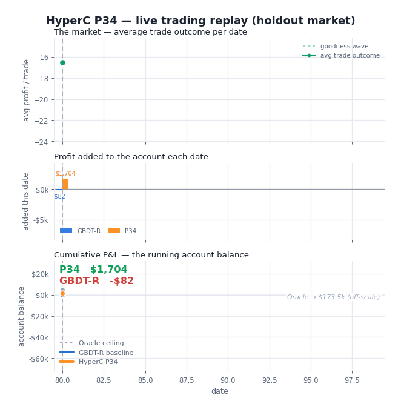
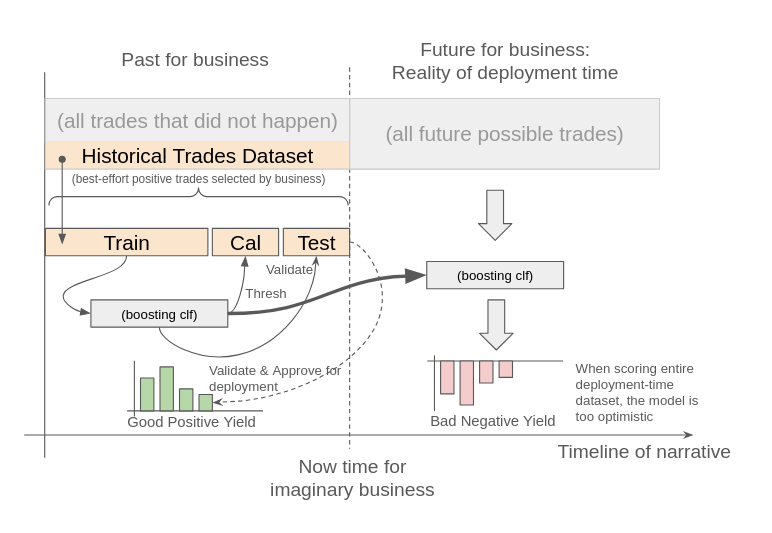

# HyperC P34 — Trading Agents Demo

> Early pre-release draft. Research and engineering demonstration only.

> **Disclaimer:** This repository and demo are provided for technical research, engineering evaluation, and discussion purposes only. They do not constitute investment advice, financial advice, trading advice, a recommendation to buy or sell any asset, or an offer to provide investment-management services. HyperC does not guarantee profit, positive returns, loss avoidance, model accuracy, live-market performance, or suitability for any particular market, business, trading strategy, or investment decision. All benchmark results shown here are experimental and may not generalize to real-world deployment. Any use of P34 or related PARML methods in a live business or trading environment requires independent validation, risk controls, compliance review, and professional judgment.

  

P34 is a generalized profit-as-regression machine learning (PARML) model designed to be a near-drop-in replacement to naive approach of training a GBDT model on biased net profit data of the trades executed by a real-world business on a partially-open market. 

Examples of partially open markets are: startup venture capital, Amazon wholesale, micro-lending, industrial supply, and many others. 

A typical net profit telemetry obtained on these markets will only expose participating businesses' attempts to filter through deals. Models trained on such telemetry usually become optimistic and cannot perform fully autonomous trades with satisfactory results.

  

We present a generalized framework to address this problem - the data schema and a model architecture that can efficiently utilize partially observed business outcomes' telemetry to autonomously enact trades in a changing real-world business operating environment.

On the 20-date holdout of the `09_baseline_slower_market_waves` market, the tuned **GBDT-R
baseline bleeds to −$62.6k** while **HyperC P34 compounds to +$25.8k** — same market, same menu.
P34 wins by *declining the false-positive trades* that sink the regressor (profitable on 16/20
dates; 14.9% of the oracle ceiling). The market itself drifts down over the horizon — declining
margin and rising efficiency — exactly the regime where naive predictors get punished.

See the included notebook for the reproducible problem definition benchmark and result discussion:

[`test_p34_09_slower_market_waves_.ipynb`](./test_p34_09_slower_market_waves_.ipynb)

The notebook walks through the biased-data problem, the synthetic slower-market-waves setup, the GBDT baseline failure mode, and the P34 portfolio-level test results.

> **Synthetic benchmark only:** These results are from a controlled synthetic market and are not a promise, guarantee, or projection of future profitability, investment performance, trading performance, or live-market results. Past, simulated, synthetic, or backtested performance is not evidence that the model will generate profit or avoid losses in any real market.

[info@hyperc.com](mailto:info@hyperc.com)
